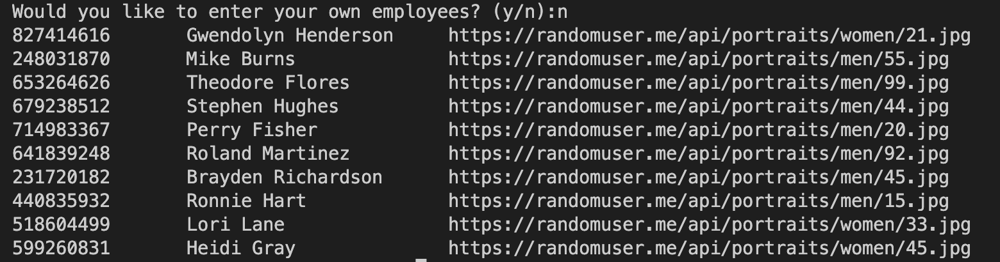

# Employee Badges Rendering App

## Description
The Employee Badges Rendering App is a C# application that runs on the terminal. It creates employee badges with manually-inputted data or data retrieved from an API.

## Table of Contents

- [Usage](#usage)
- [Credits](#credits)
- [Features & Components](#features)

## Usage

Manual input:

API/Auto input:

Badge Example:

## Credits

UCLA Extension Full-Stack Coding Bootcamp

## Features
One can generate employee badges from the terminal with this application. 

In order to run the application, the project directory must be downloaded. After download, navigate to the project's root directory in the terminal and run `dotnet run` to start the application.